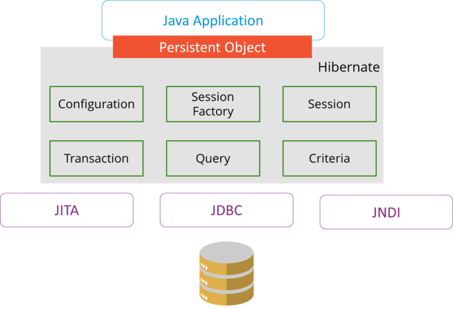

# Basic Java 

## Q1. What are JDK, JRE and JVM?

**JDK** stands for Java Development Kit. 
It is necessary for compilation, documentation or packaging Java programs.
It contains JRE and other development tools.

**JRE** stands for Java Runtime Environment.
It refers to a runtime environment in which Java byte code can be executed.
It is an implementation of the JVM abstract Machine.   

**JVM** stands for Java Virtual Machine.
It is an abstract machine. It is a specification of a runtime environment in which Java code can be executed.
It follows three notations: Specification, Implementation and Runtime Instance.

## Q2. Explain public static void main(String args[]).

The main method is the entry point for any Java program.
It needs to be public and static in order to be accessible by the JVM.
It accepts the String array parameter.

## Q3. Why is Java platform independent?

Java is platform independent because the Java code is compiled into byte code which can be run on any system.

## Q4. Why Java is not 100% OO? 

Java is not 100% OO because it has also 8 primitive data types.

## Q5. What are wrapper classes in Java? 

Wrapper classes are used to convert primitives into reference types. 
They wrap the primitive data type into an object.

## Q6. What are constructors in Java? 

In Java, a constructor is a method which has the same name as the class and has no return type.
It is called when an object of the respective class is being created.

## Q7. What is a singleton class in Java?

A singleton class in Java is a class which can be instantiated only once in a JVM.
A class can be made a singleton by making its constructor private.

## Q8. What is the difference between Array List and a Vector?

Array List is not thread safe. 
It is fast as it is not synchronized.
If am element is inserted into the Array List, it increases its size by 50%.
Array List doesn't define the increment size.
Array List can only use Iterator for traversing.

Vector is thread safe.
It is slow as it is synchronized.
It defaults to doubling size of its array.
Vector defines the increment size.
Vector can use both Enumeration and Iterator for traversing. 

## Q9. What is the difference between equals() and == in Java?

The equals() is defined in the Object class and is used for checking the equality of two objects.

The "==" is a binary operator provided by Java to compare primitives or references.

## Q10. What is the difference between Heap and Stack memory in Java?

**Stack** memory is used only by one thread of execution. 
It can't be accessed by other threads.
It follows the LIFO manner to free memory. 
The stack exists until the end of execution of the thread.
Stack memory only contains local primitive and reference variables to objects in the heap memory.

**Heap** memory is used by all the threads of execution.
Objects stored in the heap are globally accessible.
Memory management is based on the generation associated with each object.
Heap memory exists from the start till the end of application execution.
Whenever an object is created, it is always stored in the heap. 

## Q11. What is a package and what is it used for?

A package is a bundle of related classes and interfaces. Packages can be used to achieve modularity.
The advantages of using packages are as follows: 
* Packages help in avoiding name clashes.
* They provide easier access control.
* They can hide classes or interfaces that are not supposed to be access outside the package.
* Packages creat a hierarchical structure of files.

## Q12. Why Java doesn't use pointers?
 
Java doesn't use pointers in order to keep the simplicity of the code. JVM is responsible for memory allocation.
 
## Q13. What is JIT compiler in Java? 

**JIT** stands for Just-In-Time compiler in Java. 
It has the purpose of converting Java byte code into binary instructions sent to the processor.
It is enabled by default in Java and it is activated when a method is invoked.
Once a method has been compiled, the JVM summons the code directly rather than interpreting it.

## Q14. What are access modifiers in Java?

In Java, access modifiers are keywords used to restrict the access of a class, constructor, attribute or method.
Java supports 4 access modifiers as follows: public, protected, default, private. 

## Q15. What are the main concepts of OOP in Java?

* **Encapsulation** is a mechanism of grouping and hiding data together as a unit.
* **Inheritance** is a process in which a class acquires attributes or methods of another.
* **Abstraction** is a methodology of hiding the implementation and providing only the functionalities.
* **Polymorphism** is the ability of an object to take different forms via different mechanisms(e.g. overloading, overriding etc.).

## Q16. What is the final keyword?

The Java keyword final is a non access modifier. It can be assigned to a variable, method or class.
A final variable can't have its value changes once it is assigned.
A final method cannot be overridden by a subclass.
A final class cannot be extended by a subclass, but it can extend other classes.

## Q17. What are the differences between this() and super() in Java? 

The current instance of the class is represented by this().
It is used to call the default constructor or the methods of the class.

The super() represents the current instance os the parent/base class.
It is used to call the default constructor or the methods of the base class.

## Q18. What is Java String Pool? 

Java String Pool is a collection of Strings which are stored in heap memory. 
Whenever a new object is created, the String Pool checks if there is already an object with this value.
If there is one it returns the same reference, otherwise it will create a new object.

## Q19. What is the constructor chaining in Java? 

In Java, constructor chaining is the process of calling a constructor from another.
It is possible only through legacy where the superclass constructor is invoked by the subclass constructor.

## Q20. What are the differences between String, StringBuilder and StringBuffer? 

* **Storage Area**
    * Constant String Pool;
    * Heap Area;
    * Heap Area;
* **Mutability**
    * Immutable;
    * Mutable;
    * Mutable;
* **Thread Safety**
    * Yes;
    * No;
    * Yes;
* **Performance**
    * Fast;
    * More efficient;
    * Less efficient;  
    
## Q21. What is a classloader in Java?

A Java classloader is a subset of the JVM that is responsible for loading class files.
Java provides three built-in classloader types: 
1. Bootstrap Classloader;
2. Extension Classloader;
3. System/Application Classloader;

## Q22. Why Java Strings are immutable? 

In Java, Strings are immutable they are generally cached in the String pool. 
Since String literals are usually shared between multiple clients, action from one client might affect the rest. 
It enhances security, caching, synchronization, and performance of the application. 

## Q23. What are the differences between Array and ArrayList? 

Arrays cannot contain values of different data types.
The size must be defined at the time of the declaration.
In order to add data the index must be specified.
Arrays are not type parameterized.
Arrays can contain primitives as well as objects.

ArrayLists can contain values of different data types.
Size can be dynamically changed.
There is no need to specify the index when adding elements.
ArrayLists are type parameterized.
ArrayLists can contain only objects.

## Q24. What is Map in Java?

In Java, Map is an interface from Util package which doesn't extend Collection.
It stores pairs of values and unique keys.

## Q25. What is a collection in Java?

In Java, a collection is a data structure that stores and manipulates groups of data.
The collections are organized as a framework which includes interfaces, classes and methods.

# Java OOP

## Q1. What types of polymorphism are in Java?

There are 2 types of polymorphism: 
* Compile time: Method Overloading;
* Run time: Method Overriding;

## Q2. What is runtime polymorphism or dynamic method dispatch? 

The runtime polymorphism or dynamic method dispatch is achieved by having methods with the same name in a super class and its sub class.
The method implementation is based on what constructor is used when creating an instance of the super class.

## Q3. What is abstraction in Java?

Abstraction is the act of hiding the implementation from the user revealing only the functionalities.
Abstraction can be achieved by abstract classes or interfaces.

## Q4. What is an interface in Java?

An interface is a blueprint for a class.
It contains abstract methods and static constants. 
It can be subsequently implemented by a class.

## Q5. What are the differences between Abstract classes and interfaces?

An abstract class, can provide complete or abstract methods that have to be implemented.
A class can extend only one abstract class.
An abstract class, can have instance variables and constructors.
An abstract class, can have any visibility.
Abstract classes operate fast.

An interface provides only abstract methods.
A class can implement several interfaces.
An interface, cannot have instance variables or constructors.
An interface's visibility must be public or default.
Interfaces operate slow and require extra indirection to find the corresponding method in the actual class.

## Q6. What types of inheritance are in Java?

Java supports 4 types of inheritance: 
* Single: Between one parent and one child class;
* Multilevel: A class has multiple parents at different levels;
* Hierarchical: More child classes have the same parent class;
* Hybrid: Combination of the above;

## Q7. Can a private or static method be overridden?

A private or static method cannot be overridden.

## Q8. What is multiple inheritance?

Multiple inheritance means having a child class that extends multiple parent classes.
It is not supported by Java because in Java a class can extend only one class.
The problem with this technique is that if some parent classes have a method with the same name, at runtime it is difficult to decide between them.
NOTE: Diamond problem;

## Q9. What is an association?

An association is a relationship in which all the objects have their own lifecycle and there is no owner of the relation.
This can be one to one, one to many, many to one or many to many.

## Q10. What is an aggregation?

An aggregation is a special type of association in which there exists an owner.
Multiple child classes can be owned by the parent class.

## Q11. What is a composition?

A composition is another type of association in which the child classes compose the parent class.
If the parent class is destroyed so are the child ones.

## Q12. What is a marker interface?

A marker interface is an empty interface. 
It is used to mark a class rather that providing abstract methods or constants.

## Q13. What is object cloning?

Cloning an object means creating a new one of the same class as the first one and initiating it with the same state.
Java provides an interface, java.lang.Cloneable which has the method clone().

## Q14. What is a copy constructor?

A copy constructor is a member function used to initialize an object using another object of the same class.
It is not used in Java.

# Java Servlets

## Q1. What is a Servlet?

A servlet is a Java program that runs on a web server.
Servlets receive and respond to requests from web clients.
Java provides javax.servlet and javax.servlet.http packages for writing servlets.
A servlet should implement the javax.servlet.Servlet interface which defines lifecycle methods.

## Q2. What are the HTTP methods?

* GET: 
    * Request doesn't have body;
    * Response has body;
    * Safe;
    * Idempotent;
    * Cacheable;
    * Allowed in HTML forms;
* HEAD 
    * Request has body;
    * Response doesn't have body;
    * Safe;
    * Idempotent;
    * Cacheable;
    * Not allowed in HTML forms;
* POST 
    * Request has body;
    * Response has body;
    * Not safe;
    * Not idempotent;
    * Cacheable only if freshness information is included;
    * Allowed in HTML forms;
* PUT
    * Request has body;
    * Response doesn't have body;
    * Not safe;
    * Idempotent;
    * Not cacheable;
    * Not allowed in HTML forms;
* PATCH
    * Request has body;
    * Response has body;
    * Not safe;
    * Not idempotent;
    * Not cacheable;
    * Not allowed in HTML forms;
* DELETE
    * Request may have body;
    * Response may have body;
    * Not safe;
    * Idempotent;
    * Not cacheable;
    * Not allowed in HTML forms;
* TRACE
    * Request doesn't have body;
    * Response doesn't have body;
    * Not safe;
    * Idempotent;
    * Not cacheable;
    * Not allowed in HTML forms;
* OPTIONS
    * Request doesn't have body;
    * Response has body;
    * Safe;
    * Idempotent;
    * Not cacheable;
    * Not allowed in HTML forms;
* CONNECT
    * Request doesn't have body;
    * Response has body;
    * Not safe;
    * Not idempotent;
    * Not cacheable;
    * Not allowed in HTML forms;
    
## Q3. What is a Request Dispatcher?

The Request Dispatcher interface is used to forward the requests to another resource.
There are 2 methods defined in this interface: 
* void forward()
* void include()
  
## Q4. What are the differences between forward() and sendRequest() methods?

The forward() method sends the same request to another resource.
It works within the server side.

The sendRequest() method always sends a new request because it uses the URL bar of the browser.
It works on the client side.

## Q5. What is the lifecycle of a servlet?

There are 5 stages in the lifecycle of a servlet: 
* Loading;
* Instantiation;
* Initialization;
* Request;
* Destruction;

## Q6. How do cookies work in Servlets? 

Servlet API provides cookies support through javax.servlet.http.Cookie class, that implements Serializable and Cloneable.
HttpServletRequest getCookies() method gets the array of Cookies from the request.
HttpServletResponse addCookie(Cookie c) method is provided to attach cookies in response header.

## Q7. What are the differences between ServletContext and ServletConfig?

Servlet Context represents the whole web application running on a JVM and is common for all the servlets.
It is accessed with the method getServletContext().
Used for application scope wide or session data.

Servlet Config represents a single servlet.
It is accessed with the method getServletConfig().
Used for servlet scope wide data. 

## Q8. What are the methods of session management in servlets?

A session is a conversational state between the client and the server and it can consist of multiple requests and responses.
Since HTTP and Web Server are both stateless, the only way to maintain a session is through a unique information which is passed in every request.
The common ways of session management are: 
* User Authentication
* HTML hidden field
* Cookies
* URL Rewriting
* Session Management API

# JDBC 

## Q1. What is a JDBC Driver?

A JDBC Driver is a software that enables Java code to communicate with the database.
There are 4 types of JDBC drivers:
* JDBC-ODBC
* Native-API driver (partially java driver)
* Network Protocol driver (fully java driver)
* Thin driver (fully java driver)

## Q2. What are the steps to connect to a database?

1. Registering the driver class
2. Creating connection
3. Creating statement
4. Executing queries
5. Closing connection

## Q3. What are the JDBC API components?

The java.sql package contains interfaces and classes for JDBC API.

Interfaces:
* Connection
* Statement
* PreparedStatement
* ResultSet
* ResultSetMetaData
* DatabaseMetaData
* CallableStatement
* etc.

Classes:
* DriverManager
* Blob
* Clob
* Types
* SQLException
* etc.

## Q4. What is the role of JDBC DriverManager class?

The JDBC DriverManager class has the role to manage the registered drivers. 
It provides a factory method that created instances of Connection.

## Q5. What is JDBC Connection interface?

The JDBC Connection interface maintains a session with the database. 
It can be used to manage transactions.
It provides factory methods that return instances of Statement, PreparedStatement and others.

## Q6. What is JDBC ResultSet interface? 

The ResultSet object represents a row in a table.
It can be used to change the cursor pointer and get the information from the database.

## Q7. What is JDBC ResultSetMetaData interface? 

The ResultSetMetaData interface returns the information about a table such as number of columns, column name etc.

## Q8. What is JDBC DatabaseMetaData interface? 

The DatabaseMetaData interface returns the information about a database such as username, driver information, number of tables etc.

## Q9. What is a JDBC statement? 

A JDBC statement is a set of instructions used to communicate with the database.
JDBC supports 3 types of statements: 
* Statement: Used for general purpose access to the database executing static SQL queries at runtime.
* Prepared Statement: Used to execute queries with parameters that are provided during execution.
* Callable Statement: Used to access stored procedures and helps in accepting runtime parameters.

## Q10. What do you mean by batch processing in JDBC? 

Batch processing helps to group related SQL statements and to execute them together in a query.

## Q11. What is the difference between execute, executeQuery and executeUpdate?

The execute statement is used to execute any SQL query, and it returns a boolean value.
It returns true when there is a result set and false otherwise.
The result set can be retrieved using getResultSet().
The update count can be retrieved using getUpdateCount().

The executeQuery statement is used to execute SELECT queries, and it returns the ResultSet.
The returned ResultSet is never null.
In case for DML statements it throws java.sql.SQLException.

The executeUpdate statement is used to execute DML or DDL statements that return nothing.
The output is an int, and it is the row count.

# Spring Framework

## Q1. What is Spring? 

Spring is an application framework and inversion of control container for the Java platform.

## Q2. What are the modules of Spring framework?

Some of the most important modules are: 
* Spring Context: Dependency Injection;
* Spring AOP: Aspect Oriented Programming;
* Spring DAO: Database operations with Data Access Object pattern;
* Spring JDBC: JDBC and DataSource support;
* Spring ORM: Object Relational Mapping;
* Spring Web Module: For Web Applications;
* Spring MVC: Model View Controller;

## Q3. What is a bean and what are its scopes? 

A bean is an object that is instantiated, assembled and managed by the IoC container.
There are five possible bean scopes:
* Singleton: 
    One instance is created for a container. 
    This is the default scope for spring beans.
    This kind of beans should not have shared instance variables because are not thread safe.
* Prototype: 
    A copy is created every time the bean is requested.
* Request: 
    This is the same as the prototype, but it is meant for HTTP requests in a web application.
* Session
    A new bean is created for each HTTP session.
* Global-Session
    A new bean is created for a global session in a Portlet application.
    
## Q4. What are the roles of DispatcherServlet and ContextLoaderListener? 

DispatcherServlet is the front controller in the Spring MVC applications.
DispatcherServlet has the role of loading the spring bean configuration files and all the defined beans.
If annotations are enabled it also scans the packages for any bean annotated with @Component, Controller, Repository or Service.

ContextLoaderListener is the listener that starts up and shuts down the WebApplicationContext in Spring root.
Its functions include tying up the lifecycle of Application Context to the lifecycle of the ServletContext and automating the creation of ApplicationContext.

## Q5. What is autowiring in Spring? 

Autowiring gives the possibility to inject beans automatically without additional logic.

## Q6. What autowiring modes exist in Spring? 

There are 4 autowiring modes: 
* no: The default mode, which means that autowiring is not enabled.
* byName: Injects the bean based on the name property. It uses the setter.
* byType: Injects the bean based on the type property. It uses the setter.
* constructor: Injects the bean using the constructor. 

## Q7. What are the differences between constructor and setter injection? 
 
In the case of constructor injection, a new instance is created if any modification occurs.
Constructor injection doesn't support partial injection.
It is better when there are many properties.
Doesn't override the setter property.

In the case of setter injection, the existing instance is updated.
Setter injection does support partial injection.
It is better for few properties.
Does override the constructor property if both are defined.

## Q8. How to handle exceptions in Spring MVC framework? 

Spring MVC framework provides the following mechanisms for exception handling: 
* Controller based: Define exception handler in the controller classes. 
Annotate the methods with ExceptionHandler annotation.
* Global Exception Handler: Spring provides ControllerAdvice annotation that can be used with any class to define the global exception handler.
* HandlerExceptionResolver implementation: Spring Framework provides HandlerExceptionResolver interface that we can implement to create global exception handler.

## Q9. How is Hibernate integrated with Spring? 

The Spring ORM module is used to integrate Spring and Hibernate frameworks.
In Hibernate 3+ where SessionFactory provides the current session.
For the integration use DAO pattern with dependency injection.
Spring ORM provides support for using Spring declarative transaction management.

## Q10. What are the types of transaction management that Spring supports? 

Spring supports two types of transaction management:
* Programmatic transaction management: The transaction is managed with the help of programming. 
It provides extreme flexibility, but it is very difficult to maintain.
* Declarative transaction management: The transaction management is separated from the business code. 
Only annotations or XML based configurations are used to manage the transactions. 

# Hibernate

## Q1. What is Hibernate? 

Hibernate is a Java based ORM tool that provides a framework for mapping domain models to database tables and vice-versa.
It is an implementation of Java Persistence API. 

## Q2. What are the benefits of using Hibernate?

1. No need for the boiler-plate code that comes with JDBC and takes care of resource management.
2. It provides support for XML as well as JPA annotations.
3. It provides a query language, HQL that is similar to SQL. However, HQL is fully OO and understands the OOP concepts.
4. It is open source.
5. It is easy to integrate with other Java EE frameworks.
6. Has support for lazy initialization using proxy objects.

## Q3. How is organized the architecture of Hibernate? 

## Q4. What are the differences between get and load methods?

The get method returns null if the object is not found.
It always hits the database.
It returns a real object.
It should be used if the existence of the object is not guaranteed.

The load methods throws ObjectNotFoundException if the object is not found.
It doesn't hit the database.
It returns a proxy object.
It should be used if the existence of the object is guaranteed.

## Q5. What are the advantages of using Hibernate over plain JDBC API?

1. Hibernate removes boiler plate code that comes with JDBC API.
2. Hibernate supports inheritance, associations and collections.
3. It implicitly provides transaction management.
4. JDBC API throws the checked SQLException, so this needs to be handled. 
Hibernate wraps JDBC exceptions and throws JDBCException or HibernateException which is unchecked.
5. Hibernate Query Language (HQL) is more close to Java.
For JDBC there is the need to write native SQL statements.
6. Hibernate supports query caching.
7. Hibernate provides mechanisms for creating tables. 
In the case of JDBC the tables must be existent.
8. Hibernate configuration helps in using JDBC like connection as well as JNDI DataSource for the connection pool. 
This is a very important feature in enterprise application and completely missing in JDBC API.
9. Hibernate supports JPA annotations, so the code is independent of the implementation and easily replaceable with other ORM tools. 
JDBC code is very tightly coupled with the application.

# JSP

## Q1. What are the lifecycle methods of a JSP? 

* public void jspInit(): It is invoked only once, in order to init the instance;
* public void _jspService(ServletRequest request, ServletResponse response) throws ServletException, IOException: It is invoked at each request;
* public void jspDestroy(): It is invoked only once, in order to destroy the instance;

## Q2. What are the JSP implicit objects? 

1. out: JspWriter;
2. request: HttpServletRequest;
3. response: HttpServletResponse;
4. config: ServletConfig;
5. session: HttpSession;
6. application: ServletContext;
7. pageContext: PageContext;
8. page: Object;
9. exception: Throwable;

## Q3. What are the differences between include directive and include action? 

The include directive includes the content at page translation time.
It includes the original content of the page, so the page resizes at runtime.
It is better for static pages.

The include action includes the content at request time.
It doesn’t include the original content rather invokes the include method of Vendor provided class. 
It is better for dynamic pages.

## Q4. How to disable caching on back button of the browser? 

    <%
    response.setHeader(“Cache-Control”, ”no-store”);
    response.setHeader(“Pragma”, ”no-cache”);
    response.setHeader (“Expires”, “0”);
    %> 
    
## Q5. What are the tag types provided in JSTL? 

There are 5 types of JSTL tags:
1. Core tags
2. SQL tags
3. XML tags
4. Internationalization tags
5. Function tags

## Q6. How to disable a session in a JSP?

    <%@ page session="false" %>
    
## Q7. How to delete a cookie in a JSP? 

    Cookie cookie = new Cookie("name1", "value1");
    response.addCookie(cookie);
    Cookie killCookie = new Cookie("name1","value1");
    killCookie.setMaxAge(0);
    killCookie.setPath("/");
    killCookie.addCookie(killCookie);
//TODO Revise it

## Q8. What is the jspDestroy method? 

The jspDestroy method is invoked from javax.servlet.jsp.JspPage interface whenever a JSP page is about to be destroyed. 
Servlets destroy methods can be easily overridden to perform cleanup, like when closing a database connection.

## Q9. How is JSP better than Servlet technology? 

JSP is a technology on the server’s side to make content generation simple. 
They are document-centric, whereas servlets are programs. 
A Java server page can contain fragments of Java program, which execute and instantiate Java classes. 
However, they occur inside an HTML template file. 
It provides the framework for the development of a Web Application.

## Q10. Why the JSP tags should not be configured in web.xml? 

There is no need to configure JSP standard tags in web.xml because when container loads the web application and find TLD files, it automatically configures them to be used directly in the application JSP pages. 
They just need to be included in the JSP page using taglib directive.

## Q11. How to use JSP EL in order to get the HTTP method name? 

Using pageContext JSP EL implicit object one can get the request object reference and make use of the dot operator to retrieve the HTTP method name in the JSP page. 
The JSP EL code for this purpose will look like:
    
    ${pageContext.request.method}
    
# Exception handling

## Q1. What are the differences between Error and Exception? 

An error is an irrecoverable condition occurring at runtime, for example OutOfMemory error.
Though error can be caught in the catch block, but the execution of application will come to a halt and is not recoverable.

An exception on the other hand, occurs because of bad input or programmer errors.
These can be handled by providing a feedback for the programmer.

## Q2. How exceptions can be handled in Java? 

There are 5 mechanisms for exception handling in Java: 
1. try
2. catch
3. finally
4. throw
5. throws

## Q3. What are the differences between checked and unchecked exceptions? 

The checked exceptions extend the Throwable class excepting the Runtime and Error hierarchies.
These are checked at compile time.

The unchecked exceptions extend RuntimeException class.
These are not checked at compile time.

## Q4. What do the keywords final, finally and finalize do? 

The final keyword is used to apply restrictions on a class, method, or variable. 
A final class can’t be inherited, a final method can’t be overridden and a final variable value can’t be changed. 

The finally keyword is used to place code that will be executed whether the exception is handled or not. 

The finalize method is used to perform clean up processing just before the object is garbage collected.

## Q5. What are the differences between throw and throws? 

The throw keyword is used to explicitly throw an exception.
It is used in a method and it is followed by a new instance.

The throws keyword is used to declare a possible exception.
It is used in the method signature, to propagate checked exceptions.

## Q6. What is the exception hierarchy in Java? 

## Q7. How to create a custom Exception? 

To create a custom exception the new class needs to extend the Exception or any of its subclasses.

## Q8. What are the main methods of Exception class?

The main methods defined in Throwable class: 
* String getMessage: Returns the message String of Throwable and the message can be provided while creating the exception through it’s constructor.
* String getLocalizedMessage: This method is provided so that subclasses can override it to provide locale specific message to the calling program. 
Throwable class implementation of this method simply use getMessage() method to return the exception message.
* Synchronized Throwable getCause: Returns the cause of the exception or null id the cause is unknown.
* String toString: Returns the information about Throwable in String format, the returned String contains the name of Throwable class and localized message.
* void printStackTrace: This method prints the stack trace information to the standard error stream, this method is overloaded and we can pass PrintStream or PrintWriter as an argument to write the stack trace information to the file or stream.

## Q9. Is there a case when finally will not execute?

The finally block will not be executed if the program exits either by calling System.exit methods or by causing a fatal error that causes the process to abort.

## Q10. Can a try block be followed by multiple catch blocks? 

There can be multiple catch blocks under single try block, but the exceptions should be from specific to general. 

## Q11. What is OutOfMemoryError in Java? 

OutOfMemoryError is the subclass of java.lang.Error which generally occurs when our JVM runs out of memory.

# Multithreading

## Q1. What are the differences between processes and threads? 

An executing instance of a program is called a process.
Processes must use inter-process communication to communicate with sibling processes.
Processes can only exercise control over child processes.
Any change in the parent process does not affect child processes.
Run in separate memory space.
Process is controlled by the operating system.
Processes are independent.

A thread is a subset of a process.
Threads can directly communicate with other threads of its process.
Threads can exercise considerable control over threads of the same process.
Any change in the main thread may affect the behavior of the other threads of the process.
Run in shared memory space.
Threads are controlled by the programmer.
Threads are dependent.

## Q2. What is synchronization? 

Synchronization refers to multithreading. 
A synchronized block of code can be executed by only one thread at a time. 
As Java supports execution of multiple threads, two or more threads may access the same fields or objects. 
Synchronization avoids memory consistency errors caused due to inconsistent view of shared memory. 
When a method is declared as synchronized the thread holds the monitor for that method’s object. 
If another thread is executing the synchronized method the thread is blocked until that thread releases the monitor. 

## Q3. What is a thread? 

A thread is the smallest piece of programmed instructions which can be executed independently by a scheduler. 
In Java, all the programs will have at least one thread which is known as the main thread. 
This main thread is created by the JVM when the program starts its execution. 
The main thread is used to invoke the main() of the program.

## Q4. How a thread can be created in Java? 

In Java, there are two ways of creating threads: 
* By implementing the Runnable interface;
* By extending the Thread class;

## Q5. What is a garbage collector in Java? 

Garbage collector in Java is a program which helps in implicit memory management. 
Since in Java, using the new keyword you can create objects dynamically, which once created will consume some memory. 
Once the job is done and there are no more references left to the object, Java using garbage collection destroys the object and relieves the memory occupied by it. 
Java provides four types of garbage collectors:
* Serial
* Parallel
* CMS
* G1